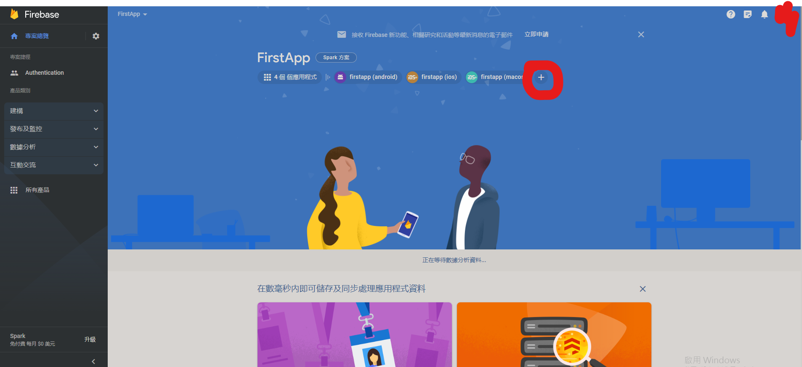
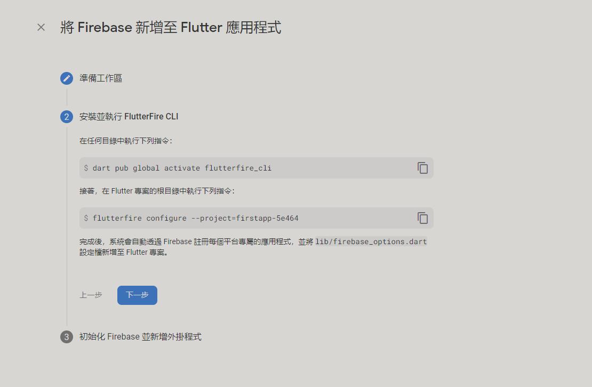
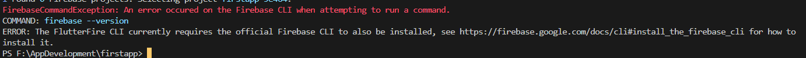
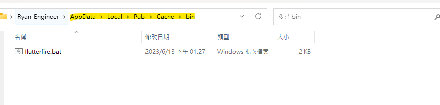
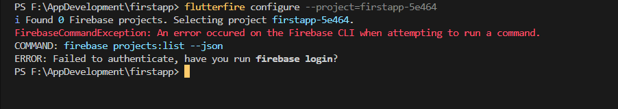
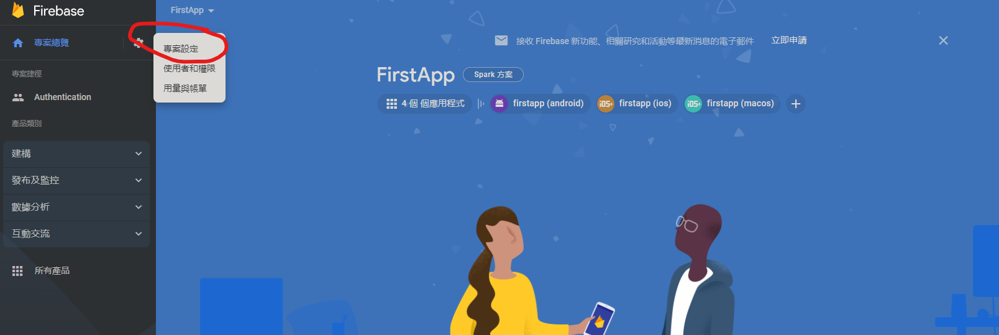
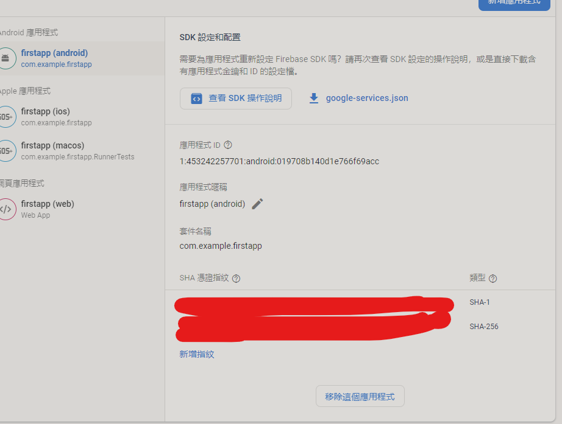

# 以下僅為android 進行相容性配置，其餘windows配置需尋找文章進行額外配置

## 以下篇章除了介紹客戶端的驗證，也會驗證伺服器端。
# 必要插件:
```
dependencies:
  flutter:
    sdk: flutter
    
  # The following adds the Cupertino Icons font to your application.
  # Use with the CupertinoIcons class for iOS style icons.
  http: ^1.0.0
  flutter_secure_storage: ^8.0.0
  ...
  firebase_auth: ^4.6.2
  google_sign_in: ^6.1.4

```
- [ ] http 用於前後端分離
- [ ] secure_storage 是用於storage 但更安全
- [ ] firebase_auth 只借用firebase 驗證，windows 需安裝 全局 firebase
- [ ] google_sign_in


推薦插件:
```
dependencies:
  flutter:
    sdk: flutter
    
  # The following adds the Cupertino Icons font to your application.
  # Use with the CupertinoIcons class for iOS style icons.
  ...
  flutter_signin_button: ^2.0.0
```
# 大綱:
整體分成兩步驟:客戶端、與伺服器端
- [ ] 客戶端:firebase_auth
- [ ] 伺服器端:socialite(# laravel 請安裝socialite，詳情見laravel官網)

# 在firebase上 為自己的應用程式加上 googleLogin

來到這個畫面

執行
```
flutterfire configure --project=firstapp-5e464
```
遇到flutterfire not recognized 的問題 請往下看

遇到問題



設置環境變量





firebase 需要登入

請在cmd依序 打上
```
npm install -g firebase-tools
firebase login
```
```
cd "你的專案路徑"
```
```
firebase init
```
在完成firebase 的所有教學。
完成以後即可使用firebase

# 代碼片段
```
GoogleSignIn _googleSignIn = GoogleSignIn(
  scopes: <String>[
    'email',
    'profile',
  ],
);
      GoogleSignInAccount? _currentUser = await _googleSignIn.signIn();
      devtools.log(_currentUser.email)
      GoogleSignInAuthentication? gSA = await _currentUser?.authentication;
        devtools.log(gSA.accessToken);

```
# 發現無法打印```_currentUser.email```
## 則必須添加sha key 到線上的firebase 專案
# 尋找android sha key
## flutter 以 java為必要安裝條件，安裝java 已經預設一個android 金鑰。此篇以尋找該金鑰為主旨


1. 先將keytool 加進環境變量(C:\Program Files\Java\jre-{$yourJavaVersion}\bin)
   
      win 11 將java 的環境變量位置另設，需要找尋java 的安裝位置，才能運用java 的keytool。

      親身試過 兩個java環境變量不會有衝突(#檔案位置截然不同)

2. cmd 測試keytool

3. 尋找金鑰:```keytool -list -v -keystore C:\Users\{$userName}\.android\debug.keystore -storepass android -keypass android```

      正常來說 ```C:\Users\{$userName}``` 可以被省略成```~/``` 也就是 ```~/.android/debug.keystore``` 不知道為什麼不行。

4. ``不需要自己產生金鑰，android在安裝的時候已經將debug.keystore安裝在 該有的地點了 keypass 和 keystore 都是 android``

5. ``這裡需要注意的是，此金鑰為預設金鑰是專門做debug使用，未來上線安全起見，還會再給一組金鑰。``

6. 就可得到 憑證指紋，也就是尚未加密過的原始資料，將其copy 並放到 firebase上



# 完成以上步驟即可完成客戶端的firebase驗證

# 小細節:如果使用者folder名子含有space必須先escape掉
只要前面加一個\表示是特殊符號就好
更好的辦法是使用字串
如下:
keytool -list -v -keystore "C://Users/Software Engineer/.android/debug.keystore -storepass android -keypass android"